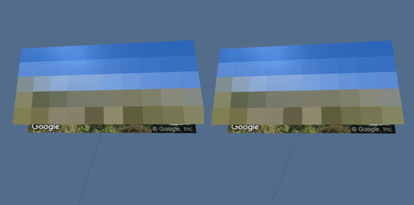

# Color-Trip-VR

Color Trip is a WebVR experience that uses Google’s Street View Image API and Mozilla’s A-Frame to generate a colorful virtual reality journey along a desired route.  After defining an origin and destination, the program taps into Google’s Direction Service and returns a driving route. It then sequentially displays Street View images along the path and creates blocks representing the average colors of the image. The goal of the experience is to create an automated virtual color experience of a road trip. It is still a work in progress. I am looking to incorporate more dynamic components and features that capture the potential of VR and create a richer experience.

